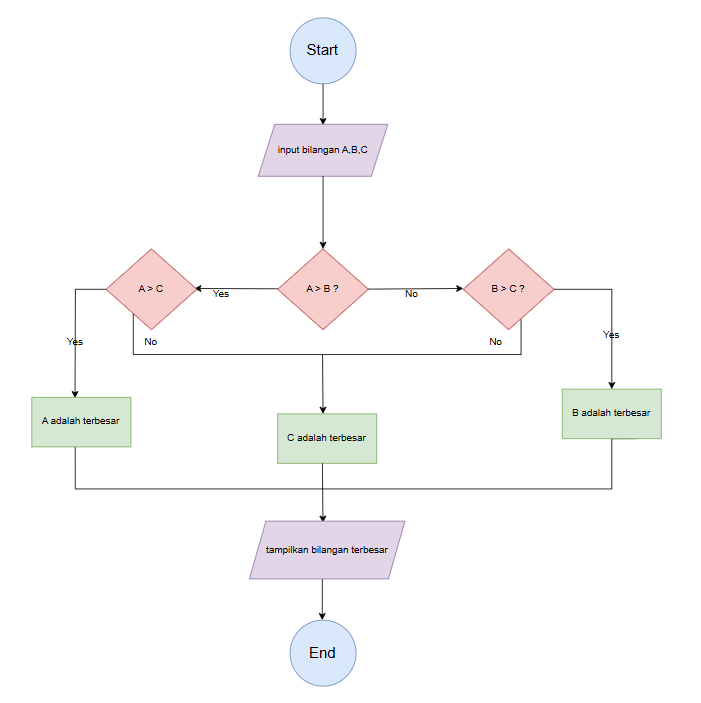

# Dwi Okta Ramadhani
# TI.24.A.1
# Program Untuk Menemukan Bilangan Terbesar dari 3 Variabel
Program ini dirancang untuk menentukan bilangan terbesar dari tiga angka yang diberikan oleh pengguna. Dengan menggunakan struktur kontrol sederhana, program ini akan membandingkan ketiga bilangan dan mengidentifikasi mana yang memiliki nilai tertinggi.

## Deskripsi Program
Program ini di buat menggunakan bahasa Python dengan fitur:
* Minta pengguna untuk memasukkan tiga bilangan.
* Simpan nilai-nilai tersebut ke dalam variabel.
* Bandingkan ketiga variabel menggunakan struktur if untuk menentukan nilai maksimum.
* Tampilkan hasilnya ke layar.

## Flowchart Programan


## Kode Program
```python
a = int(input ("masukan angka: "))

b = int(input ("masukan angka: "))

c = int(input ("masukan angka: "))

if a > b:
    if a > c :
        terbesar = a
    else:
        terbesar = c       
else:
    if b > c:
        terbesar = b
    else:
        terbesar = c

print ( f"Bilangan terbesar adalah {terbesar}")
```

## Output Program
````
PS C:\Users\acer\Documents\KULIAH\PEMROGRAMAN\Latihan 3> python -u "c:\Users\acer\Documents\KULIAH\PEMROGRAMAN\Latihan 3\code program 1.py"
masukan angka: 55
masukan angka: 90
masukan angka: 120
Bilangan terbesar adalah 120
