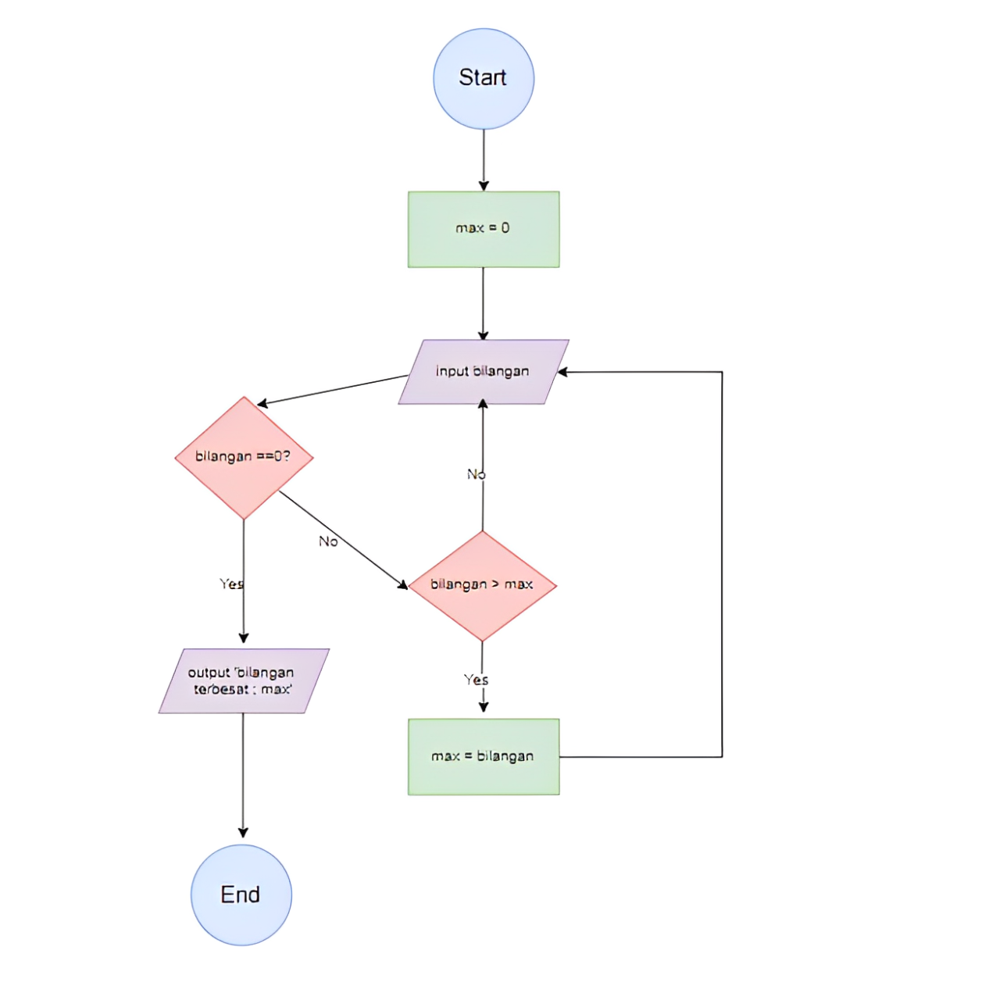

# Dwi Okta Ramadhani
# TI.24.A.1
# Program 2 Untuk Mencari Bilangan Terbesar Dan Program 1 Menemukan Bilangan Terbesar dari 3 Variabel
Program 2 ini dirancang mencari nilai terbesar dari sekumpulan bilangan yang dimasukan oleh pengguna menggunakan loop While True dan Break statement.
Sedangkan Program 1 untuk menentukan bilangan terbesar dari tiga angka yang diberikan oleh pengguna. Dengan menggunakan struktur kontrol sederhana, program ini akan membandingkan ketiga bilangan dan mengidentifikasi mana yang memiliki nilai tertinggi.

## Deskripsi Program ke 2 
Program ini dibuat menggunakan bahasa Python dengan fitur:

- Menggunakan while true untuk perulangan tak terbatas
- Menggunakan break statement untuk menghentikan program
- Membandingkan setiap input dengan nilai maksimum yang tersimpan
- Menampilkan bilangan terbesar yang ditemukan

  ## Flowchart Program
  


## Deskripsi Program
Program ini di buat menggunakan bahasa Python dengan fitur:
* Minta pengguna untuk memasukkan tiga bilangan.
* Simpan nilai-nilai tersebut ke dalam variabel.
* Bandingkan ketiga variabel menggunakan struktur if untuk menentukan nilai maksimum.
* Tampilkan hasilnya ke layar.

## Flowchart Programan


## Cara Kerja Program 1
Program ini dimulai dengan meminta pengguna untuk memasukkan tiga angka. Setelah angka-angka tersebut dimasukkan, program menggunakan fungsi if (Jika) untuk menentukan angka yang paling besar di antara ketiga angka tersebut. Fungsi if(Jika) secara otomatis membandingkan semua angka dan mengembalikan yang terbesar. Setelah menemukan angka terbesar, program menampilkan hasilnya kepada pengguna dengan kalimat yang jelas. Dengan cara ini, kode menjadi lebih ringkas dan mudah dibaca, tanpa perlu membuat banyak kondisi untuk perbandingan. melakukan pengecekan dengan urutan :

* Apakah A > B?
* Jika ya: cek apakah A > C? Jika ya: A adalah terbesar
* Jika tidak: C adalah terbesar
* Jika tidak: cek apakah B > C?
* Jika ya: B adalah terbesar
* Jika tidak: C adalah nilai terbesar

## Kode Program
```python
a = int(input ("masukan angka: "))

b = int(input ("masukan angka: "))

c = int(input ("masukan angka: "))

if a > b:
    if a > c :
        terbesar = a
    else:
        terbesar = c       
else:
    if b > c:
        terbesar = b
    else:
        terbesar = c

print ( f"Bilangan terbesar adalah {terbesar}")
```

## Output Program
````
PS C:\Users\acer\Documents\KULIAH\PEMROGRAMAN\Latihan 3> python -u "c:\Users\acer\Documents\KULIAH\PEMROGRAMAN\Latihan 3\code program 1.py"
masukan angka: 55
masukan angka: 90
masukan angka: 120
Bilangan terbesar adalah 120
