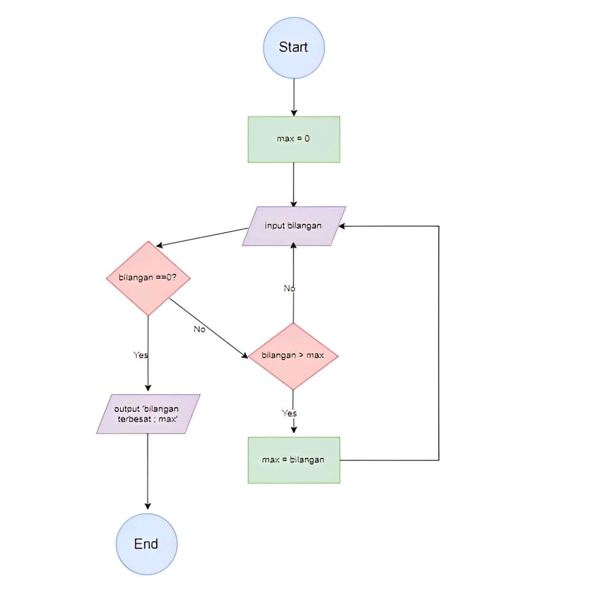

# Program Mencari Bilangan Terbesar
Program 2 sederhana untuk mencari nilai terbesar dari sekumpulan bilangan yang dimasukan oleh pengguna menggunakan loop While True dan Break statement. 

## Deskripsi Program 2
Program ini dibuat menggunakan bahasa Python dengan fitur:
- Menggunakan while true untuk perulangan tak terbatas
- Menggunakan break statement untuk menghentikan program
- Membandingkan setiap input dengan nilai maksimum yang tersimpan
- Menampilkan bilangan terbesar yang ditemukan

  ## Flowchart Program
  

# Cara Kerja Program 2
adanya variable max disini dengan nilai 0, setelah itu terdapat variabel inputan dengan nama bilangan, jika kondisi
bilangan tidak sama dengan 0 maka cari bilangan lebih dari max dan variabel max di set dengan bilangan tersebut. jika bilangan
lebih kecil dari, max maka bilangan input kembali sehingga akan menghasilkan bilangan terbesar dari operasi tersebut.

  ## Kode Program
  Python
  max = 0
  Bilangan = int(input("masukan bilangan :"))
  while Bilangan != 0:
    if Bilangan > Max :
      Max = Bilangan
  Bilangan = int(input("maukan bilangan :"))

  print(f"bilangan terbesar {max}")

# output program
`malah 
masukan bilangan : 75
masukan bilangan : 120
masukan bilangan : 230
masukan bilangan : 460
masukan bilangan : 600
masukan bilangan : 0
bilangan terbesar : 600

`
